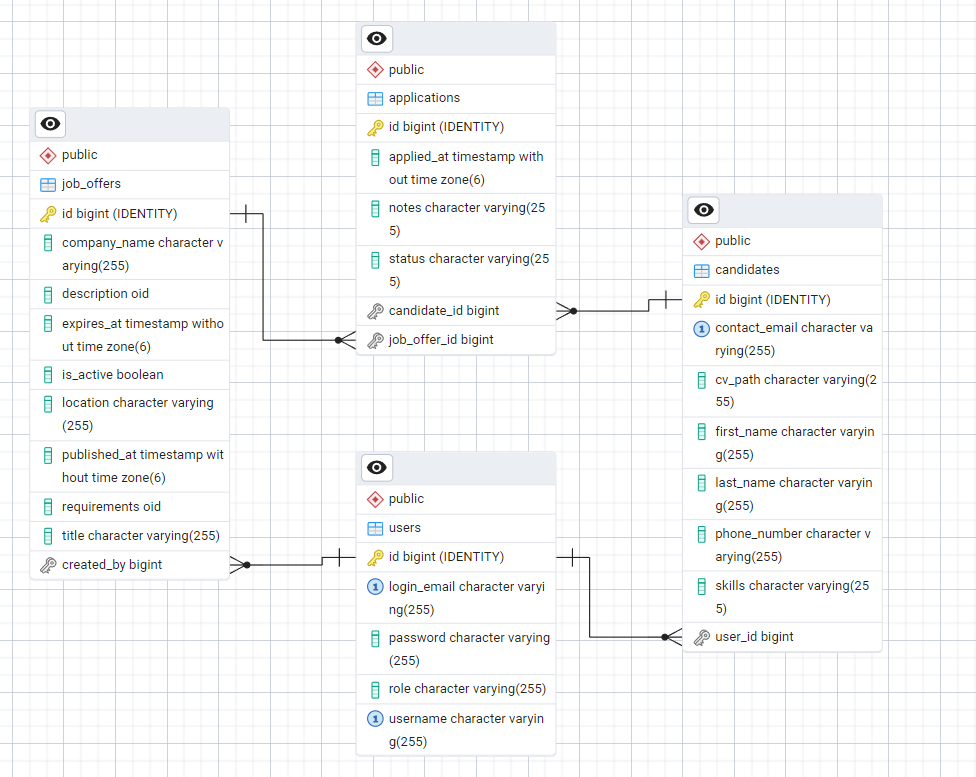
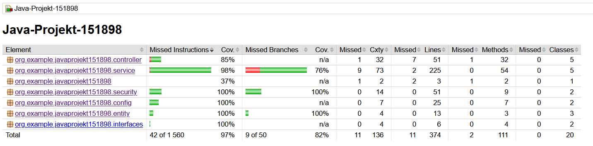

# System rekrutacji i zarządzania kandydatami w firmie HR

## 🎯 Opis projektu

System rekrutacyjny to kompleksowa aplikacja Spring Boot umożliwiająca efektywne zarządzanie procesem rekrutacji w firmie HR. Aplikacja oferuje funkcjonalności związane z publikacją ofert pracy, rejestracją kandydatów oraz monitorowaniem postępów rekrutacji.

## 🚀 Główne funkcjonalności

- **👥 Zarządzanie użytkownikami**
    - Rejestracja i logowanie użytkowników
    - System ról - kandydat / HR / administrator

- **💼 Zarządzanie ofertami pracy**
    - Publikowanie nowych ofert
    - Zarządzanie statusem ofert
    - Określanie wymagań i opisów stanowisk

- **👔 Obsługa kandydatów**
    - Rejestracja kandydatów
    - Przechowywanie CV
    - Śledzenie statusu aplikacji

- **📊 Raportowanie**
    - Monitorowanie postępów rekrutacji
    - Statystyki aplikacji

## 📁 Struktura projektu
src/
  main/
    java/org/example/javaprojekt151898/
            ├── controller/   # Kontrolery REST API
            ├── service/      # Warstwa logiki biznesowej
            ├── security/     # Konfiguracja bezpieczeństwa
            ├── config/       # Konfiguracja aplikacji
            ├── entity/       # Encje bazodanowe
            └── interfaces/   # Interfejsy

## 🗄️ Schemat bazy danych (ERD)

## 🔗 API Endpoints

### Auth API - operacje powiązane z uwierzytelnianiem
- `POST /auth/register` - Rejestracja nowego użytkownika
- `POST /auth/login` - Logowanie użytkownika
- `POST /auth/change-password` - Zmiana aktualnego hasła na nowe
- `POST /auth/promote-hr` - Zmiana roli kandydata na HR
- `PUT /auth/user-details` - Aktualizacja danych użytkownika

### Użytkownicy
- `GET /api/users/{id}` - Wyświetlenie użytkownika dla danego ID
- `PUT /api/users/{id}` - Aktualizacja danych użytkownika
- `DELETE /api/users/{id}` - Usunięcie danego użytkownika
- `GET /api/users` - Wyświetlenie listy wszystkich użytkowników
- `POST /api/users` - Utworzenie nowego użytkownika

### Oferty pracy
- `GET /api/job-offers/{id}` - Pobranie oferty pracy dla danego ID
- `PUT /api/job-offers/{id}` - Aktualizacja danej oferty pracy
- `DELETE /api/job-offers/{id}` - Usunięcie oferty pracy dla danego ID
- `GET /api/job-offers` - Wyświetl wszystkie aktualne oferty pracy
- `POST /api/job-offers` - Utwórz nową ofertę pracy

### Kandydaci
- `GET /api/candidates/{id}` - Wyświetlenie kandydata dla danego ID
- `PUT /api/candidates/{id}` - Aktualizacja danych dla danego kandydata
- `DELETE /api/candidates/{id}` - Usunięcie danego kandydata
- `GET /api/candidates` - Wyświetlenie listy wszystkich kandydatów
- `POST /api/candidates` - Utworzenie nowego kandydata
- `GET /api/candidates/by-job-offer/{jobOfferId}` - Wyświetlenie listy kandydatów dla danej oferty pracy

### Aplikacje
- `GET /api/applications/{id}` - Wyświetlenie aplikacji dla danego ID
- `PUT /api/applications/{id}` - Aktualizacja danej aplikacji
- `DELETE /api/applications/{id}` - Usunięcie danej aplikacji
- `GET /api/applications` - Wyświetlenie listy wszystkich aplikacji
- `POST /api/applications` - Utworzenie nowej aplikacji

## 🧪 Testy jednostkowe

Projekt został dokładnie przetestowany przy użyciu JUnit i Mockito. 

Raport pokrycia kodu wygenerowany przez JaCoCo pokazuje wysokie pokrycie testami:

### Statystyki pokrycia:
- **Całkowite pokrycie**: 97%
- **Pokrycie metod**: 111 ze 113 metod
- **Pokrycie klas**: 20 z 20 klas

## 🎨 Wykorzystane wzorce projektowe

- **MVC (Model-View-Controller)**
    - Separacja logiki biznesowej od warstwy prezentacji

- **DTO (Data Transfer Object)**
    - Transfer danych między warstwami aplikacji

- **Repository Pattern**
    - Abstrakcja dostępu do bazy danych

- **Service Layer**
    - Enkapsulacja logiki biznesowej

- **Builder**
    - Tworzenie złożonych obiektów

- **Factory Method**
    - Tworzenie obiektów bez określania ich konkretnych klas

- **Singleton**
    - Wykorzystany w konfiguracji Spring

## 🛠️ Technologie

- Java 17
- Spring Boot
- Spring Security
- Spring Data JPA
- Docker
- PostgreSQL
- JUnit 5
- Mockito
- JaCoCo
- Maven
